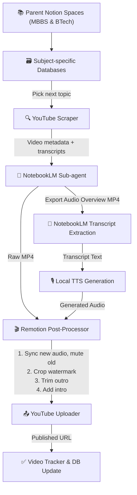

# EduContent Automation Pipeline — Implementation Plan

An end-to-end system to automatically create educational YouTube videos for 11th & 12th students (Medical + Non-Medical streams) — driven by syllabus progression, powered by NotebookLM research, rendered via Remotion, and orchestrated through Notion databases.

---


## System Architecture



---

## Proposed Changes

### Component 1: Notion Database Layer

A hierarchical database structure designed for production-level organization.

---

#### [NEW] Notion Spaces (MBBS and BTech)
Instead of flat databases, we will create two master Parent Pages (Spaces):
1. **MBBS Space**
2. **BTech (CSE) Space**

#### [NEW] Syllabus Databases (Subject-specific)
Inside each Space, an individual database will be generated for every subject.

**CRITICAL UPDATE**: The syllabus will be structured granularly: **Subject → Chapter → Topic**. Each _Topic_ represents a single video, not the entire chapter.

**MBBS Subjects (Examples)**: Anatomy, Biochemistry, Physiology, etc.
**BTech Subjects (Examples)**: Computational Mathematics, Basic Electronics, Data Structures, etc.

**Schema per database:**

| Property | Type | Purpose |
|---|---|---|
| `Topic` | Title | Granular topic name (e.g., "Arrays vs Linked Lists") |
| `Chapter` | Select/Text | Parent chapter name (e.g., "Data Structures") |
| `Status` | Select | `Pending` / `In Progress` / `Completed` / `Failed` |
| `Video URL` | URL | YouTube link once published |
| `Created Date` | Date | When video was produced |

---

#### [NEW] Video Tracker Database (Global)

Central log of all produced videos across all streams and subjects:

| Property | Type | Purpose |
|---|---|---|
| `Title` | Title | Video title |
| `Stream` | Select | MBBS / BTech |
| `Subject` | Text | Subject name |
| `Topic` | Text | Topic covered |
| `YouTube URL` | URL | Published video link |
| `Published Date` | Date | Upload timestamp |
| `Status` | Select | `Uploaded` / `Processing` / `Failed` |

---

### Component 2: YouTube Scraper Module

#### [NEW] `d:\notebook lm\scraper\youtube_scraper.js`

A Node.js script that:
1. Takes a **topic name** + **subject** as input
2. Calls YouTube Data API v3 `search.list` for relevant educational videos
3. Filters by relevance, view count, and channel quality
4. Extracts top video URLs directly (without needing to download transcripts).
5. Outputs a simple array of the highest-viewed YouTube video links for the topic.

**Dependencies**: `googleapis`, `youtube-transcript`, `dotenv`

---

### Component 3: NotebookLM Generation & Extraction

#### [NEW] `d:\notebook lm\research\notebooklm_subagent.js`

A browser-automation subagent (since NotebookLM has no official API for click-interactions) that:
1. Creates a notebook per topic.
2. Inputs the scraped **direct YouTube URLs** as main data sources.
3. Instructs NotebookLM to generate deep research material / briefing docs internally to add supplementary context.
4. Triggers the **Audio Overview generation** (which exports as an MP4 with visual waveforms).
5. Downloads the MP4 file to a local temp folder.
6. Queries NotebookLM to **extract the transcript** of the generated podcast conversation.

---

### Component 4: Remotion Post-Processor & Audio Sync

#### [NEW] `d:\notebook lm\video\` — Remotion Project

This component sanitizes and edits the raw NotebookLM video export to make it production-ready and monetizable:

1. **Cloud TTS Generation (Qwen3 TTS on Colab)**: Feeds the enhanced transcript to the Qwen3 TTS voice clone server running on Google Colab (T4 GPU). The reference audio (`voice/Recording (14).m4a`) and its transcript are sent with every API call to maintain voice consistency.
   - **Colab Notebook**: `https://colab.research.google.com/drive/1uV6ZIqg3M9mwi-9Leplkmntn94rKEh9S`
   - **Local wrapper**: `video/tts_generator.js` → calls Colab Gradio API via `gradio_client`
   - **URL manager**: `video/colab_manager.js` → auto-detects expired Colab sessions
2. **Audio Replacement**: Mutes the original NotebookLM audio track in the MP4 and seamlessly syncs the newly generated Qwen TTS audio track.
3. **Video Trimming (Outro Removal)**: Automatically slices off the final few seconds of the MP4 to guarantee the NotebookLM ending bumper/logo is completely removed.
4. **Watermark Removal**: Crops the bottom 60px of the video to remove the NotebookLM watermark, then pads back to 1080p.
5. **Intro Splicing & Catchy Hooks**: Prepends your custom AXIOM intro video (`assets/axiom_intro.mp4`). The `transcript_enhancer.js` dynamically generates natural intro/outro scripts.
6. **Brand Overlays**: Adds AXIOM logo watermark (top-left, 60% opacity) and subscribe button (bottom-right, 80% opacity).
7. **Final Render**: Uses FFmpeg to export the finalized video ready for YouTube upload.

#### [PENDING] Engine 1: Transcript Timestamp Generator
- **File**: `video/engines/engine_1_transcribe.py` (NOT YET BUILT)
- Uses Whisper to generate word-level timestamps for both original and new TTS audio
- Critical for Engine 2's forced alignment

#### [PENDING] Engine 2: Visual Slicer & Forced Alignment Sync
- **File**: `video/engines/engine_2_sync.py` (NOT YET BUILT)
- Maps original video timestamps to new TTS timestamps
- Uses FFmpeg to stretch/compress video segments so visuals perfectly match new voice pacing

---

### Component 5: YouTube Uploader

#### [NEW] `d:\notebook lm\uploader\youtube_uploader.js`

Uses YouTube Data API v3 `videos.insert` and `playlists.insert` with **OAuth2** authentication (using `client_secret_...json`):
1. Authenticates locally.
2. **Playlist Management**: Checks if a playlist for the **Subject** exists (creates if not). Checks if a playlist for the **Chapter** exists (e.g., named "Subject - Chapter") and creates it if not. *Note: YouTube doesn't support true "nested" playlists, so the video will be added to both flat playlists to simulate this hierarchy.*
3. Uploads rendered MP4.
4. Adds the video to both the Subject playlist and the Chapter playlist.
5. Sets title, description, tags.
6. Returns published video URL.
7. Updates Notion databases.

---

### Component 6: Agent Framework

#### [NEW] `d:\notebook lm\agent.md`

The reusable agent instruction file that can be loaded in any future session. Contains:
- Full pipeline steps with decision trees
- All MCP tool references
- Notion DB IDs (populated after setup)
- Error handling & retry logic
- Daily execution protocol

---

## Pipeline Execution Flow (Daily Run)

```
1. READ Pipeline Queue DB → get next subject + topic (Any Board, 11th or 12th)
2. CHECK Video Tracker → confirm topic not already done
3. SCRAPE YouTube → collect 5-10 relevant videos on the topic
4. FEED NotebookLM → create/update notebook, add sources, research
5. GENERATE script → trigger NotebookLM Audio Overview & download transcript
6. TTS GENERATION → Pass transcript to local QUEN TTS model using user's voice sample
7. RENDER video → Remotion post-processing: Add catchy hooks/Intro, swap audio, crop watermark, trim Outro
8. UPLOAD to YouTube → correct playlist, optimized catchy title & metadata
9. UPDATE Notion → mark topic complete, log video URL, advance queue
10. REPEAT for next subject (round-robin across MBBS/BTech subjects daily)
```

---

## Verification Plan

### Automated Tests
1. **Notion DB creation**: Query each database after creation to verify schema matches spec
2. **Scraper output**: Run scraper on a known topic (e.g., "Newton's Laws of Motion"), verify JSON output contains title, description, transcript fields
3. **NotebookLM research**: Ask a test question, verify non-empty structured response
4. **Remotion render**: Render a 30-second test composition, verify MP4 output exists and is playable

### Manual Verification (User)
1. **Review Notion databases** — open Notion, verify databases appear with correct columns
2. **Review test video** — watch the first rendered 30-second sample, confirm quality
3. **Review YouTube upload** — verify the test upload appears on your channel with correct metadata
4. **Approve agent.md** — read the agent framework file, confirm it captures the full workflow

---

## Execution Order

| Step | Component | Est. Time | Dependencies |
|---|---|---|---|
| 1 | Notion DB setup | ~10 min | None |
| 2 | YouTube scraper | ~30 min | YouTube API key |
| 3 | NotebookLM pipeline | ~20 min | Auth (done ✅) |
| 4 | Remotion project setup | ~45 min | Remotion skill |
| 5 | YouTube uploader | ~30 min | YouTube OAuth |
| 6 | Agent.md framework | ~15 min | All above components |
| 7 | End-to-end test run | ~30 min | Everything |
